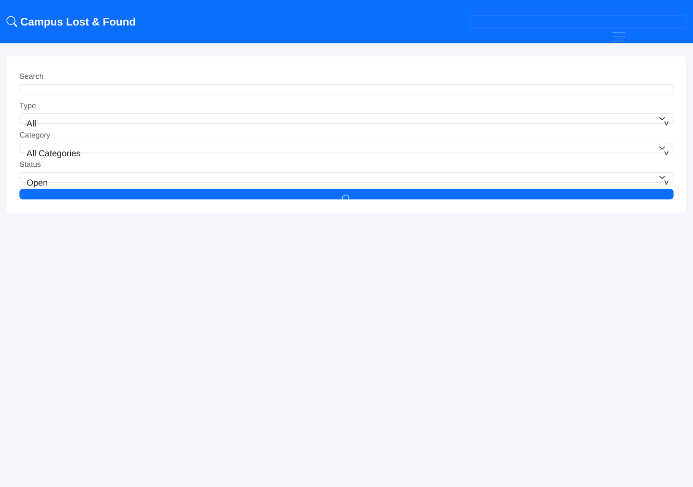
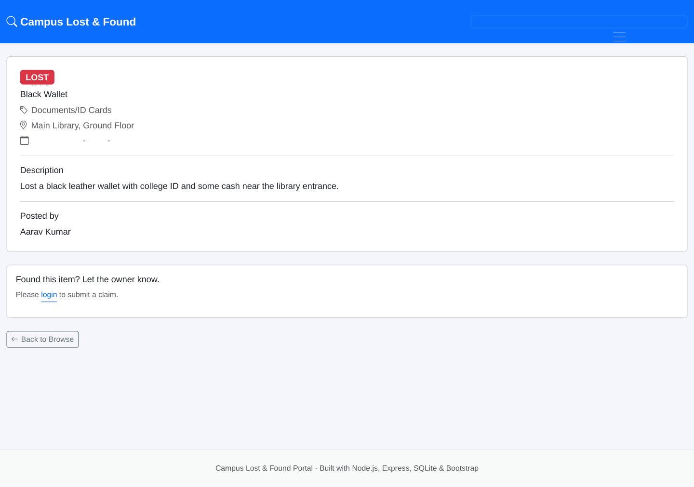
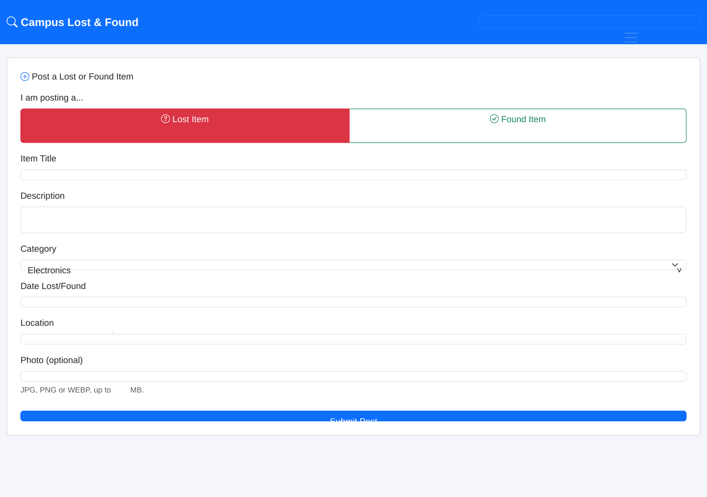
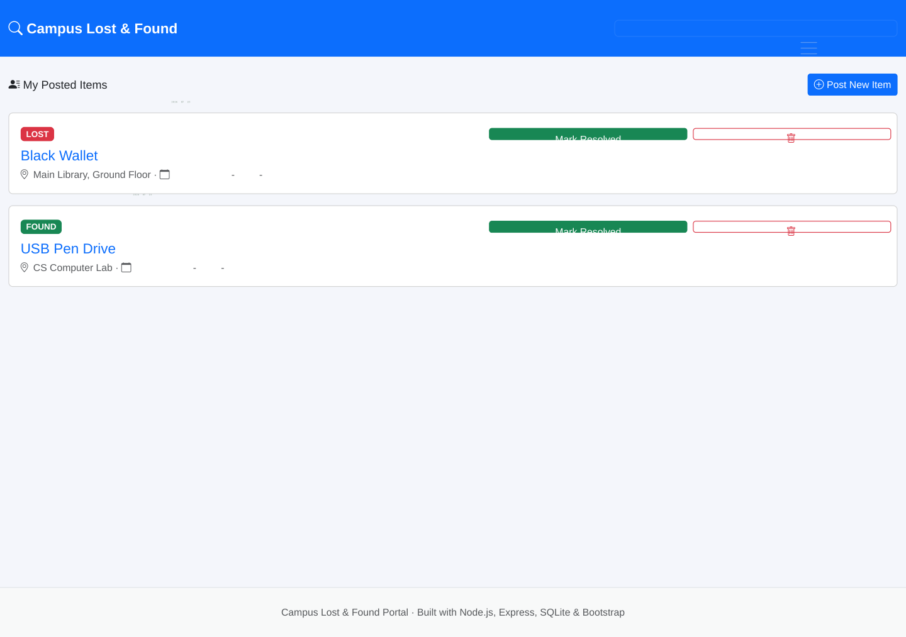

<div align="center">

# 🔍 Campus Lost & Found Portal

**A full-stack web platform that helps students reunite with lost belongings — built to solve a problem every campus actually has.**

[](https://nodejs.org/)
[](https://expressjs.com/)
[](https://www.sqlite.org/)
[](https://getbootstrap.com/)
[](https://ejs.co/)
[](LICENSE)

[Live Demo](#) · [Report Bug](#) · [Request Feature](#)

</div>

---

## 📌 The Problem

Every campus has the same recurring, low-tech headache: someone loses a wallet, ID card, or laptop charger, and there's no reliable way to report it or find out someone turned it in. WhatsApp groups get flooded and forgotten, noticeboards get ignored, and items pile up unclaimed at a security desk nobody checks. This project replaces that ad-hoc process with a searchable, centralized web portal.

## 🖼️ Screenshots

| Browse & Search | Item Detail |
|---|---|
|  |  |

| Post an Item | My Posts & Claims |
|---|---|
|  |  |

## ✨ Features

| Feature | Description |
|---|---|
| 🔐 Authentication | Secure registration/login with bcrypt password hashing and session-based auth |
| 📝 Post Items | Report a lost or found item with category, location, date, and optional photo |
| 🔎 Search & Filter | Filter by type (lost/found), category, status, or free-text keyword search |
| 🤝 Claim System | Users submit claims on an item; posters receive the claimant's contact info directly — no info exposed publicly |
| ✅ Resolve/Delete | Post owners can mark items resolved once reunited, or remove stale posts |
| 📱 Responsive UI | Fully responsive Bootstrap 5 layout, usable on mobile and desktop |

## 🧱 Tech Stack

| Layer | Technology |
|---|---|
| Backend | Node.js, Express.js |
| Database | SQLite (`better-sqlite3`) |
| Frontend / Templating | EJS, Bootstrap 5, Bootstrap Icons |
| Auth | `express-session`, `bcryptjs` |
| File Uploads | Multer |

## 🗂️ Database Schema

```
users
├── id (PK)
├── name
├── email (unique)
├── password (bcrypt hash)
└── phone

items
├── id (PK)
├── user_id (FK → users.id)
├── type (lost | found)
├── title, description, category, location, event_date
├── image_path
└── status (open | resolved)

claims
├── id (PK)
├── item_id (FK → items.id)
├── claimer_id (FK → users.id)
├── message
└── created_at
```

Foreign keys are enforced (`PRAGMA foreign_keys = ON`) and the database runs in WAL mode for better concurrent read performance.

## 🔌 API / Routes Overview

| Method | Route | Description | Auth Required |
|---|---|---|---|
| GET | `/items` | Browse/search/filter items | No |
| GET | `/items/new` | Show post-item form | Yes |
| POST | `/items/new` | Create a new item post | Yes |
| GET | `/items/:id` | View item detail | No |
| POST | `/items/:id/claim` | Submit a claim on an item | Yes |
| POST | `/items/:id/resolve` | Mark own item resolved | Yes (owner) |
| POST | `/items/:id/delete` | Delete own item | Yes (owner) |
| GET | `/my-items` | View own posts + received claims | Yes |
| GET/POST | `/login`, `/register`, `/logout` | Auth flows | — |

## 🚀 Getting Started

### Prerequisites
- Node.js v18+
- npm

### Installation
```bash
git clone https://github.com/Dharshancr/campus-lost-found-portal.git
cd campus-lost-found-portal
npm install
```

### Environment Variables
```
PORT=3000
SESSION_SECRET=your-long-random-secret
```

### Run
```bash
npm start
```
Visit `http://localhost:3000`. The SQLite database and demo data are created automatically on first run.

**Demo credentials:**
| Email | Password |
|---|---|
| aarav@campus.edu | demo1234 |
| priya@campus.edu | demo1234 |

## 🧠 Skills Demonstrated

- RESTful route design and server-side rendering with Express + EJS
- Relational schema design with foreign keys across three linked tables
- Secure authentication (password hashing, session management, route guards)
- File upload handling with validation (Multer)
- Search/filter query building with parameterized SQL (SQL-injection safe)
- Privacy-conscious feature design (contact info revealed only after a claim is submitted, not publicly listed)

## 🛣️ Roadmap / Future Improvements

- [ ] Email notifications when a claim is submitted (Nodemailer)
- [ ] Pagination for large item listings
- [ ] Admin role for content moderation
- [ ] Migrate session store to `connect-sqlite3` for persistence across restarts
- [ ] Deploy with a persistent-disk host (Render/Fly.io) for production use

## 📄 License

This project is licensed under the MIT License.

## 👤 Author

**DHARSHAN P**
Full Stack Developer | B.E. Computer Science & Engineering
📍 Coimbatore, Tamil Nadu, India

- LinkedIn: https://www.linkedin.com/in/dharshan-p-56b240297
- GitHub: https://github.com/Dharshancr/
- Portfolio: https://dharshancr.github.io/Portfolio/

# campus-lost-found-portal

# campus-lost-found-portal
